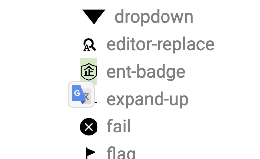
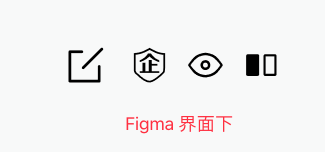

# gitee-icons-cheatsheet

#### 介绍

本项目代码开源，字体图标取自码云企业版，版权归码云所有，不算在本仓库的开源范畴。

码云 pages 服务调整中，暂时用 [github](https://janpoem.github.io/gitee-icons-cheatsheet/public/) 的吧。

#### Figma 中使用说明

1. 本地安装了 Gitee Icon 字体（注意最新版本是 Gitee Icon）
2. 打开这个 [图标搜索页面](https://janpoem.github.io/gitee-icons-cheatsheet/public/)
3. 选中需要的图标，如下图
   

4. 在 Figma 界面直接粘贴即可，字体和图标的 unicode 会自动复制过去。

